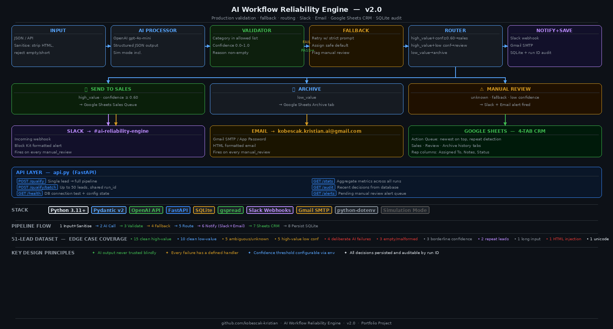

# AI Workflow Reliability Engine — v2.0

## The Problem With AI in Operations

AI classification is useful. It is also probabilistic — the 
model can return the wrong category, a confidence score above 
1.0, an empty field, or a malformed response. Downstream 
operational systems are not forgiving. A wrong routing decision 
reaches a sales team, a CRM, or a support queue before anyone 
notices.

Most AI workflow demos stop at classification. This system 
handles what happens when the model is wrong.

## What This System Does

A validation and fallback layer that sits between an AI 
classifier and your operational systems. Every AI response 
is validated, every failure is handled, every decision is 
logged — before anything reaches a downstream action.

**Who this is for:** Teams using AI in operational workflows — 
sales automation, CRM enrichment, support routing, document 
processing — where invalid AI output has a real cost.

## Why Not Just Use Rules?

Rules work on clean, predictable input. AI handles the messy 
cases rules cannot — ambiguous leads, unstructured text, 
mixed signals. This system makes AI output safe enough for 
operations by adding the validation and fallback layer that 
rules-based systems don't need but AI systems always do.

## Outcome

Across 51 test records including deliberate edge cases:

- Zero invalid AI outputs reached downstream systems
- Every failure routed to a safe handling path — no silent errors
- Only uncertain cases flagged for human review — 
  high-confidence decisions actioned automatically
- Every decision traceable by run ID across multiple sessions
- Full operational loop closed: AI call → validation → 
  routing → Slack alert → Google Sheets CRM → SQLite audit

Supporting evidence: validation caught invalid category, 
out-of-range confidence (1.5), and empty required field. 
Sanitiser rejected HTML injection, whitespace-only input, 
and malformed records. Fallback triggered on 2 records — 
both handled without system failure.

## Architecture

## Business Value

| Component | What it prevents |
|---|---|
| Input sanitiser | Malformed or injected input reaching the AI call |
| Pydantic validator | Invalid AI output silently passing to operations |
| Fallback logic | AI failure breaking the workflow |
| Confidence threshold | Low-confidence decisions being auto-actioned |
| Manual review routing | Blanket human review — only uncertain cases escalated |
| SQLite audit trail | Untraceable AI decisions across runs |
| Google Sheets CRM | AI output disconnected from operational workflow |
| Slack + email alerts | Silent manual review queue with no notification |

## How It Works

8-stage linear pipeline:

1. **Input + Sanitise** — loads records from JSON or API, 
   strips HTML, rejects empty and malformed inputs
2. **AI Processor** — calls OpenAI gpt-4o-mini, requires 
   structured JSON. Simulation mode runs without API key.
3. **Validator** — checks all required fields, value types, 
   allowed categories, confidence range (0.0–1.0)
4. **Fallback** — validation failure triggers retry with 
   strict prompt. Second failure assigns safe default + 
   manual review flag.
5. **Router** — maps category + confidence + fallback 
   status to final decision
6. **Notify** — Slack webhook + HTML email on every 
   manual_review decision
7. **Google Sheets CRM** — inserts to 4-tab workbook, 
   newest on top, repeat leads flagged automatically
8. **Persist** — every decision written to SQLite with 
   run ID for cross-run audit

## Routing Logic

| Condition | Decision |
|---|---|
| high_value + confidence ≥ 0.60 | send_to_sales |
| high_value + confidence < 0.60 | manual_review |
| low_value | archive |
| unknown category or fallback triggered | manual_review |

## Trigger Options
- CLI: `python main.py`
- API: `POST /qualify` · `POST /qualify/batch` (up to 50 leads)

## API Endpoints

| Endpoint | Purpose |
|---|---|
| `POST /qualify` | Single lead — full pipeline |
| `POST /qualify/batch` | Batch up to 50 leads, shared run ID |
| `GET /stats` | Aggregate metrics across all runs |
| `GET /audit` | Recent decisions from database |
| `GET /audit/{lead_id}` | Decision history for specific lead |
| `GET /alerts` | Pending manual review queue |
| `GET /health` | DB connection + config state |

## Stack
Python 3.11+ · Pydantic v2 · OpenAI API (gpt-4o-mini) · 
FastAPI · SQLite · gspread · google-auth · Slack Incoming 
Webhooks · Gmail SMTP · python-dotenv

## Key Design Decisions

**Pydantic v2 at every pipeline boundary:** Nothing passes 
between stages without schema validation. Silent failures 
are structurally impossible.

**Simulation mode built in:** Full pipeline runs and 
demonstrates all failure modes without an API key. 
Reproducible demo including deliberate edge cases.

**Confidence threshold via environment variable:** 
Configurable per deployment — not hardcoded. Threshold 
change requires no code modification.

**SQLite for zero-dependency persistence:** Supports 
indexed queries and cross-run lead history without 
external infrastructure.

**4-tab Google Sheets CRM:** Action Queue (newest on top), 
Sales, Review, Archive. Repeat leads detected and flagged 
automatically.

## Why This Project Matters

This is not a demo that stops at classification. It combines:

- AI call with structured output requirement
- Validation at every pipeline boundary
- Fallback that handles every failure mode explicitly
- Routing that maps uncertainty to safe defaults
- Notifications that close the operational loop
- Audit persistence that makes every decision traceable

Designed for operational reliability, not demo accuracy. 
Shows how to make probabilistic AI usable inside 
business workflows.

## Related Projects

- Decision Engine → [https://github.com/kobescak-kristian/ai-decision-engine-feedback]

Generates structured decisions that this system validates and routes.

This system ensures that AI decisions are:
- valid
- consistent
- safe to execute

## Known Limitations
**Single retry:** No exponential backoff — one retry only.

**No API authentication:** Endpoints open. Production 
requires auth middleware.

**SQLite:** Not suitable for distributed deployment. 
Production upgrade: PostgreSQL.

**Google Sheets rate limits:** Large batches may hit 
API limits. Production upgrade: batch writes with backoff.

**Simulation retry:** Forced-invalid records always fail 
retry — intentional for demo reproducibility.

*Production path: PostgreSQL · async task queue · 
API authentication · exponential backoff · 
webhook input source.*

## Status
Complete — v2.0

## Repository Structure
